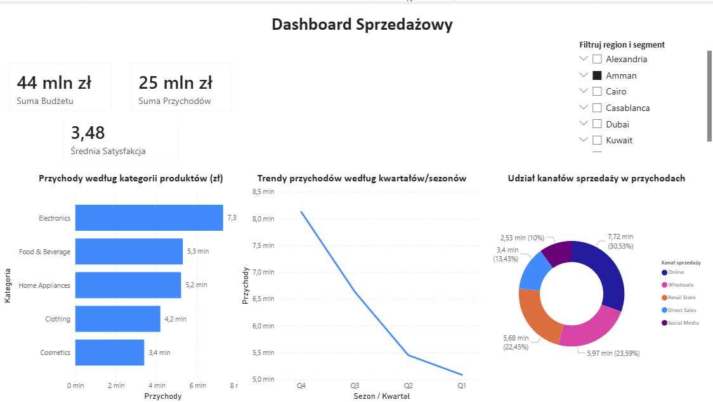
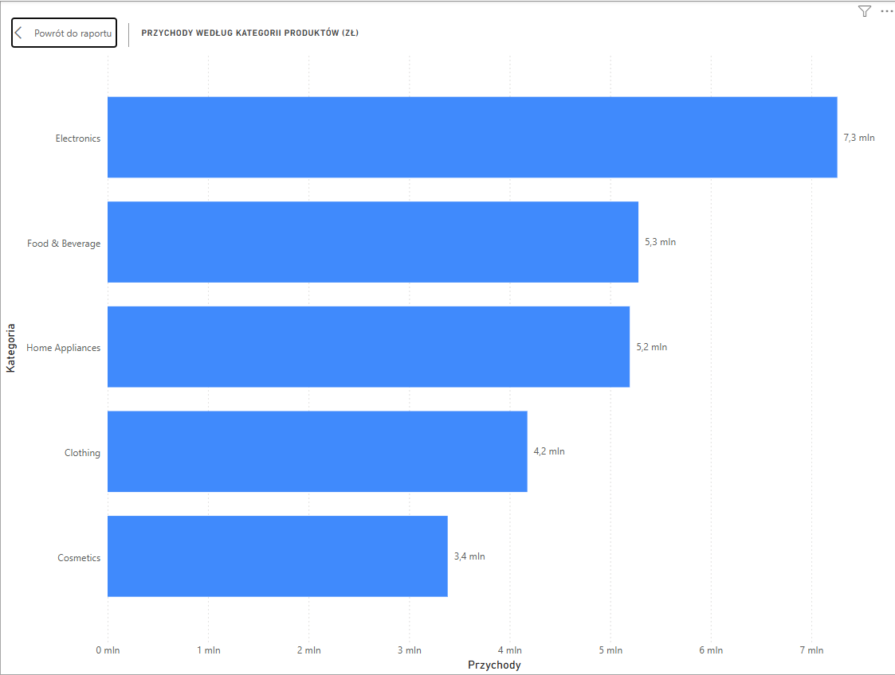
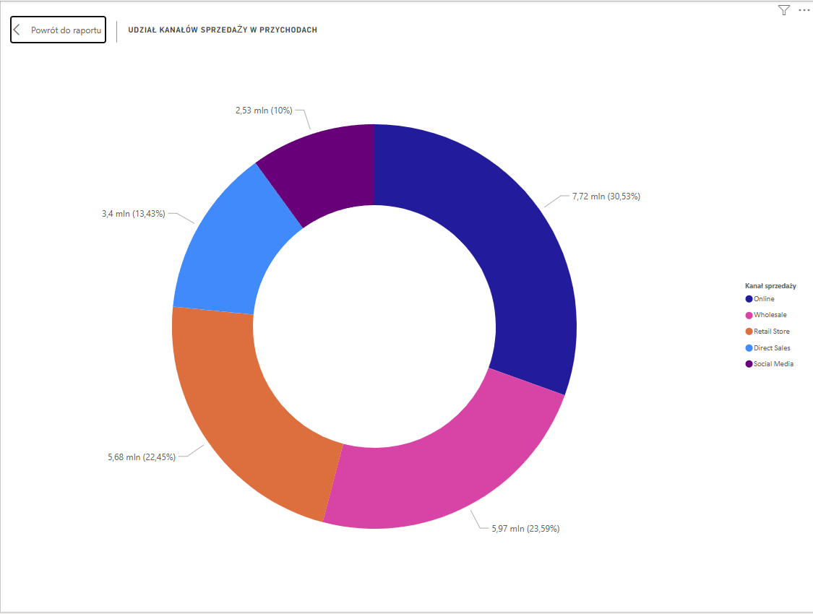
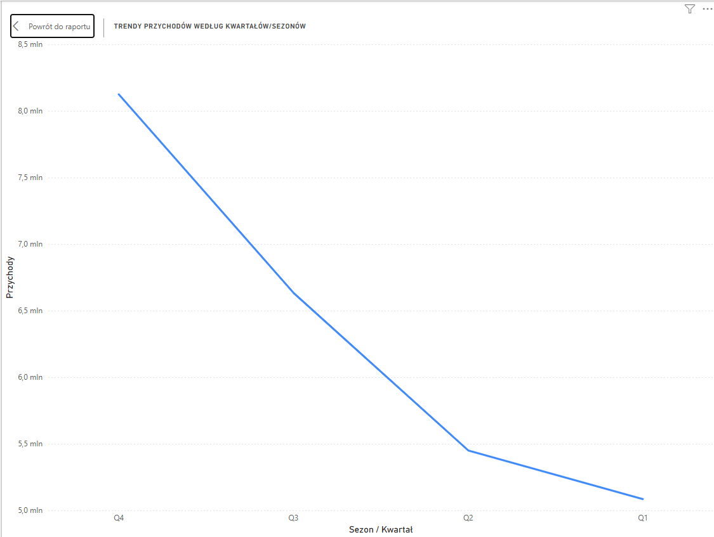

# 📊 E-Commerce Sales & Marketing Analytics Dashboard | SQL + Power BI

## 📌 Project Overview

Projekt przedstawia kompleksową analizę danych sprzedażowych oraz marketingowych sklepu internetowego z wykorzystaniem narzędzi **PostgreSQL, Excel oraz Power BI**.

Celem projektu było przeprowadzenie pełnego procesu analitycznego typu **end-to-end** — od przygotowania surowych danych, przez transformacje SQL, aż po stworzenie interaktywnego dashboardu wspierającego podejmowanie decyzji biznesowych.

Analiza koncentruje się na czterech głównych obszarach:

- 📈 **Sales Performance** — analiza sprzedaży oraz wydajności kategorii produktowych,
- 👥 **Customer Segmentation** — analiza zachowań i wartości poszczególnych grup klientów,
- 📢 **Marketing Effectiveness** — ocena relacji pomiędzy kosztami marketingowymi a wygenerowanymi przychodami,
- 🌍 **Regional Sales Analysis** — analiza sprzedaży według lokalizacji.

Projekt pokazuje kompletny proces pracy analityka danych — od surowych danych transakcyjnych do gotowych wniosków biznesowych.

---

# 🎯 Business Questions

Analiza została przeprowadzona w celu odpowiedzi na następujące pytania biznesowe:

- Które kategorie produktów generują największy przychód?
- Które kanały sprzedaży odpowiadają za największą wartość biznesową?
- Jak różnią się zachowania zakupowe poszczególnych segmentów klientów?
- Czy koszty marketingowe przekładają się na wzrost sprzedaży?
- Które regiony generują największy udział w przychodach?
- Jak zmieniają się trendy sprzedażowe w czasie?

---

# 📂 Dataset

Źródło danych:

🔗 **Kaggle:**  
[Marketing & Sales Dataset by Abdelfattah Ibrahim](https://www.kaggle.com/datasets/abdelfattahibrahim/marketing-sales-dataset)

Zbiór danych zawiera około **60 000 rekordów** obejmujących informacje dotyczące:

- klientów,
- produktów i kategorii,
- kanałów sprzedaży,
- kosztów marketingowych,
- przychodów,
- ocen satysfakcji,
- lokalizacji klientów.

---

# 🛠️ Tools & Technologies

| Narzędzie | Zastosowanie |
|---|---|
| **PostgreSQL** | Data Cleaning, ETL, analiza SQL |
| **MS Excel** | Analiza ad-hoc, segmentacja klientów, tabele przestawne |
| **Power BI Desktop** | Modelowanie danych, DAX, dashboard biznesowy |

---

# 🔄 Data Preparation & SQL Analysis

Pierwszy etap projektu obejmował przygotowanie oraz transformację danych w PostgreSQL.

## Data Cleaning

Wykonane działania:

- import danych CSV do bazy danych,
- przygotowanie struktury tabel,
- obsługa brakujących wartości,
- standaryzacja danych.

Wykorzystane techniki:

- `COALESCE()` — obsługa wartości NULL,
- `CASE WHEN` — tworzenie dodatkowych flag biznesowych.

---

## Data Transformation & Business Logic

Wykorzystano zaawansowane zapytania SQL:

### Funkcje okna:

- `AVG() OVER(PARTITION BY...)`
- `DENSE_RANK()`

Zastosowania:

- uzupełnianie brakujących ocen satysfakcji średnią dla danej kategorii,
- ranking produktów według popularności,
- analiza wyników według regionów.

---

## Marketing Effectiveness Analysis

Przygotowano dodatkową logikę biznesową umożliwiającą analizę efektywności działań marketingowych:

- porównanie kosztów kampanii z wygenerowanym przychodem,
- klasyfikacja wyników marketingowych,
- identyfikacja bardziej efektywnych obszarów inwestycji.

---

# 📊 Power BI Dashboard

Dashboard został przygotowany jako interaktywne narzędzie wspierające analizę sprzedaży, klientów oraz działań marketingowych.



---

# 1. Sales Performance Analysis

Sekcja przedstawia:

- całkowity przychód,
- sprzedaż według kategorii,
- strukturę kanałów sprzedaży,
- trendy sprzedażowe.



---

## 🔎 Key Insights

- Analiza wykazała nierównomierny rozkład przychodów pomiędzy kategoriami produktowymi.
- Najbardziej wartościowe kategorie odpowiadają za największą część sprzedaży i stanowią kluczowe obszary biznesowe.
- Trend sprzedaży pozwala identyfikować okresy wzrostu oraz potencjalnej sezonowości.

## 💡 Business Recommendation

> Firma powinna koncentrować działania sprzedażowe i marketingowe na kategoriach generujących największą wartość oraz monitorować ich dostępność w celu utrzymania ciągłości sprzedaży.

---

# 2. Customer & Channel Segmentation Analysis

Analiza obejmuje:

- segmenty klientów,
- zachowania zakupowe,
- porównanie kanałów sprzedaży.



---

## 🔎 Key Insights

- Poszczególne segmenty klientów wykazują różne zachowania zakupowe oraz różną wartość biznesową.
- Kanały sprzedaży różnią się pod względem generowanych przychodów oraz charakterystyki klientów.
- Dane pozwalają lepiej zrozumieć, które grupy klientów wymagają indywidualnego podejścia.

## 💡 Business Recommendation

> Kampanie marketingowe powinny być dostosowane do charakterystyki poszczególnych segmentów klientów zamiast stosowania jednego uniwersalnego podejścia.

---

# 3. Regional & Sales Trend Analysis

Analiza przedstawia:

- sprzedaż według lokalizacji,
- trendy w czasie,
- regionalne różnice w wynikach.



---

## 🔎 Key Insights

- Analiza geograficzna pozwala określić regiony generujące największą wartość sprzedażową.
- Trendy czasowe umożliwiają identyfikację okresów wzrostu oraz zmian w zachowaniach zakupowych.
- Wyniki pomagają wskazać obszary wymagające dodatkowej uwagi biznesowej.

## 💡 Business Recommendation

> Działania marketingowe oraz sprzedażowe powinny być priorytetyzowane w regionach charakteryzujących się największym potencjałem wzrostu.

---

# 📈 Key Business Insights Summary

## 1. Sales Optimization

Zidentyfikowano kategorie produktowe oraz kanały sprzedaży mające największy wpływ na wyniki finansowe firmy.

## 2. Customer Understanding

Segmentacja klientów umożliwia lepsze dopasowanie działań marketingowych oraz sprzedażowych.

## 3. Marketing Effectiveness

Analiza relacji pomiędzy kosztami marketingowymi a przychodami pozwala ocenić skuteczność prowadzonych działań.

## 4. Data-Driven Decisions

Dashboard Power BI umożliwia szybki dostęp do kluczowych wskaźników i wspiera podejmowanie decyzji opartych na danych.

---

# 📁 Repository Structure

```text
📂 ecommerce-sales-marketing-analysis

│── 1_data_cleaning_and_analysis.sql
│
│── 2_customer_segmentation_report.xlsx
│
│── 3_ecommerce_marketing_dashboard.pbix
│
│── dashboard_preview.png
│── chart_categories.png
│── chart_channels.png
│── chart_trends.png
│
└── README.md
