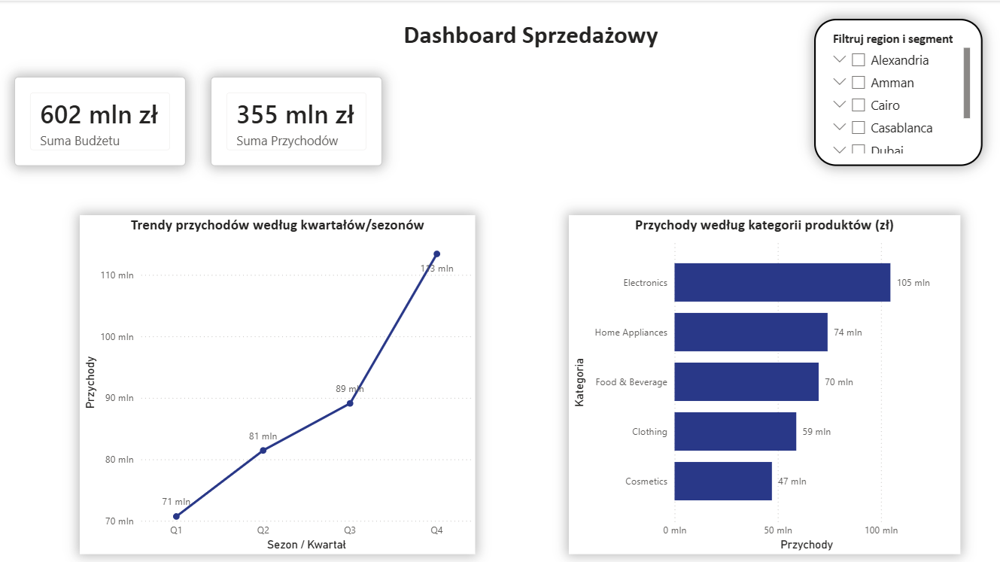
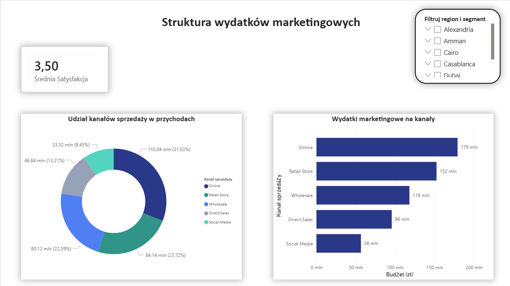

# 📊 E-Commerce Sales & Marketing Analytics Dashboard | SQL + Power BI

## 📌 Project Overview
Projekt przedstawia kompleksową analizę danych sprzedażowych oraz marketingowych sklepu internetowego z wykorzystaniem stosu technologicznego: **PostgreSQL, MS Excel oraz Power BI**.

Celem projektu było przeprowadzenie pełnego procesu analitycznego typu **end-to-end** — od przygotowania surowych danych, przez transformacje SQL, aż po stworzenie interaktywnego, dwustronicowego dashboardu wspierającego podejmowanie strategicznych decyzji biznesowych.

Analiza koncentruje się na czterech głównych obszarach:
* 📈 **Sales Performance** — analiza przychodów, realizacji budżetu oraz wydajności kategorii produktowych.
* 👥 **Customer Segmentation** — analiza zachowań zakupowych oraz wartości poszczególnych grup klientów.
* 📢 **Marketing Effectiveness** — ocena alokacji kosztów marketingowych w kanałach i ich przełożenia na wyniki.
* 🌍 **Regional Sales Analysis** — analiza dystrybucji sprzedaży według lokalizacji geograficznych.

Projekt pokazuje kompletny proces pracy analityka danych (Data Analyst / BI Engineer) — od surowych danych transakcyjnych do gotowych wniosków biznesowych.

---

## 🎯 Business Questions
Analiza została przeprowadzona w celu dostarczenia odpowiedzi na następujące pytania biznesowe:
* Które kategorie produktów generują największy przychód i powinny być traktowane priorytetowo?
* Jak kształtują się trendy sprzedażowe oraz sezonowość w poszczególnych kwartałach?
* Jak wygląda struktura alokacji wydatków marketingowych na poszczególne kanały dotarcia?
* Które kanały sprzedaży odpowiadają za największą wartość biznesową i udział w budżecie?
* Jakie są wskaźniki satysfakcji klientów w odniesieniu do prowadzonych działań?
* Które regiony (huby gospodarcze) generują największy udział w przychodach firmy?

---

## 📂 Dataset
* **Źródło danych:** Platforma Kaggle – [Marketing & Sales Dataset by Abdelfattah Ibrahim](https://www.kaggle.com/datasets/abdelfattahibrahim/marketing-sales-dataset)
* **Wolumen:** Zbiór danych zawiera około **60 000 rekordów**, co pozwoliło na przeprowadzenie zaawansowanych symulacji biznesowych.
* **Zakres danych:** Dane obejmują m.in. profile klientów, kategorie produktowe, kanały dystrybucji, koszty marketingowe, przychody, oceny satysfakcji oraz lokalizacje klientów (m.in. Alexandria, Amman, Cairo, Casablanca, Dubai, Riyadh).

---

## 🛠️ Tools & Technologies

| Narzędzie | Zastosowanie w projekcie |
| :--- | :--- |
| **PostgreSQL** | Import danych, proces ETL, czyszczenie danych (Data Cleaning), zaawansowana analiza SQL |
| **MS Excel** | Analiza ad-hoc, wstępna segmentacja klientów, weryfikacja danych za pomocą tabel przestawnych |
| **Power BI Desktop** | Modelowanie danych, zaawansowane miary DAX, projektowanie interaktywnego interfejsu (UI/UX) |

---

## 🔄 Data Preparation & SQL Analysis

Pierwszy etap projektu obejmował przygotowanie, czyszczenie oraz transformację danych bezpośrednio w bazie PostgreSQL.

### Data Cleaning
* Zaprojektowanie struktury tabeli i import surowego pliku CSV (60k wierszy) do bazy danych.
* Obsługa brakujących wartości (`NULL`) w kolumnach z rabatami przy użyciu funkcji `COALESCE()`.
* Standaryzacja typów danych i przygotowanie czystych relacji pod modelowanie BI.

### Data Transformation & Business Logic
W procesie transformacji wykorzystano zaawansowane zapytania i funkcje SQL:
* **Funkcje okna (`AVG() OVER(PARTITION BY...)`)** — wykorzystane do inteligentnego uzupełnienia brakujących ocen satysfakcji klientów średnią wartością wyliczoną dla danej kategorii produktu.
* **Funkcje okna (`DENSE_RANK()`)** — zastosowane do stworzenia rankingu popularności produktów i wolumenu sprzedaży w poszczególnych regionach.
* **Logika warunkowa (`CASE WHEN`)** — wdrożenie dodatkowych flag biznesowych umożliwiających automatyczną klasyfikację efektywności finansowej i ocenę rentowności działań marketingowych.

---

## 📊 Power BI Dashboard
Raport został celowo rozbity na dwie dedykowane strony. Pozwoliło to na optymalne zagospodarowanie przestrzeni (brak uciętych etykiet danych), zachowanie wysokiej estetyki (zastosowanie nowoczesnej, głębokiej palety granatów) oraz logiczny podział na widok czysto sprzedażowy i marketingowy.

---

### 📄 Strona 1: Dashboard Sprzedażowy (Sales Performance)
Ta strona służy kadrze zarządzającej do błyskawicznego monitorowania ogólnej kondycji finansowej firmy, porównania przychodów z założonym budżetem oraz analizy asortymentu.



#### 🔎 Key Insights
* **Wysoka realizacja finansowa:** Firma wygenerowała 355 mln zł przychodu przy całkowitym budżecie wynoszącym 602 mln zł.
* **Silna sezonowość:** Wykres trendów jednoznacznie wskazuje na skokowy wzrost sprzedaży w ujęciu kwartalnym – od 71 mln zł w Q1 do aż 113 mln zł w Q4.
* **Dominacja kategorii:** Kategoria *Electronics* jest kluczowym motorem napędowym biznesu, generując najwyższy jednostkowy przychód na poziomie 105 mln zł. Tuż za nią plasują się *Home Appliances* (74 mln zł) oraz *Food & Beverage* (70 mln zł).

#### 💡 Business Recommendation
> Rekomenduje się intensyfikację zatowarowania i zabezpieczenie łańcuchów dostaw dla kategorii *Electronics* oraz *Home Appliances* przed wejściem w drugą połowę roku (Q3/Q4). Pozwoli to w pełni obsłużyć zidentyfikowany, naturalny pik sezonowy i uniknąć strat związanych z brakiem asortymentu (stockout).

---

### 📄 Strona 2: Struktura Wydatków Marketingowych (Marketing & Customer Insights)
Druga strona raportu koncentruje się na efektywności alokacji kapitału reklamowego w poszczególnych kanałach oraz monitorowaniu poziomu zadowolenia konsumentów.



#### 🔎 Key Insights
* **Dominacja kanału Online:** Sprzedaż internetowa (*Online*) generuje najwyższy przychód – odpowiada za **31,03% udziału w strukturze sprzedaży (110,04 mln zł)**. Wynika to bezpośrednio z faktu, że na ten obszar przeznaczono największy budżet marketingowy, wynoszący **179 mln zł**.
* **Stabilna satysfakcja:** Średnia satysfakcja klientów utrzymuje się na stałym, zdrowym poziomie 3,50/5, co świadczy o stabilnej i powtarzalnej jakości obsługi we wszystkich kanałach.
* **Niskie nakłady na Social Media:** Kanał *Social Media* notuje najniższe wyniki w całym zestawieniu. Wygenerował zaledwie **33,52 mln zł przychodu (9,45% udziału)**, co jest bezpośrednio powiązane z najniższym budżetem marketingowym ulokowanym w tym kanale (**56 mln zł**).

#### 💡 Business Recommendation
> Wysokie budżety ulokowane w kanałach *Online* oraz *Retail Store* przynoszą stabilne i najwyższe zwroty finansowe. Niski wynik kanału *Social Media* nie wynika z jego nieskuteczności, a z wyraźnego niedofinansowania (budżet jest ponad 3-krotnie mniejszy niż w przypadku Online). Rekomenduje się stopniową relokację części środków na rzecz kampanii w *Social Media* w celu aktywacji tego niedoszacowanego kanału dotarcia i podniesienia jego konwersji.

---

## 📈 Key Business Insights Summary

### 1. Sales Optimization
Identyfikacja kategorii *Electronics* jako zdecydowanego lidera przychodów na pierwszej stronie raportu pozwala firmie na lepsze zarządzanie zatowarowaniem, optymalizację marżowości oraz planowanie przestrzeni magazynowej przed szczytami sprzedażowymi.

### 2. Marketing Effectiveness
Dzięki bezpośredniemu zestawieniu struktury przychodów z budżetami marketingowymi, biznes zyskał twarde dane pozwalające ocenić rentowność każdego kanału. Wyraźnie widać, że inwestycje w kanały cyfrowe (*Online*) i tradycyjne (*Retail Store*) skutecznie napędzają sprzedaż.

### 3. Customer Understanding
Utrzymanie wskaźnika średniej satysfakcji na poziomie 3,50 stanowi świetny punkt odniesienia (benchmark). Umożliwi to działom Customer Success precyzyjne mierzenie wpływu przyszłych programów lojalnościowych lub zmian w polityce obsługi na zadowolenie klienta.

### 4. Data-Driven Decisions
Rozbicie raportu na dwa dedykowane widoki (finansowy i marketingowy) wyeliminowało chaos informacyjny. Dashboard w obecnej formie dostarcza kadrze zarządzającej przejrzystych wskaźników KPI, skracając czas potrzebny na podejmowanie strategicznych decyzji opartych na danych.
---

## 📁 Repository Structure
```text
📂 ecommerce-sales-marketing-analysis
│
├── 1_data_cleaning_and_analysis.sql    
├── 2_customer_segmentation_report.xlsx 
├── 3_ecommerce_marketing_dashboard.pbix
│
├── dashboard_page_1.png                
└── dashboard_page_2.png                
